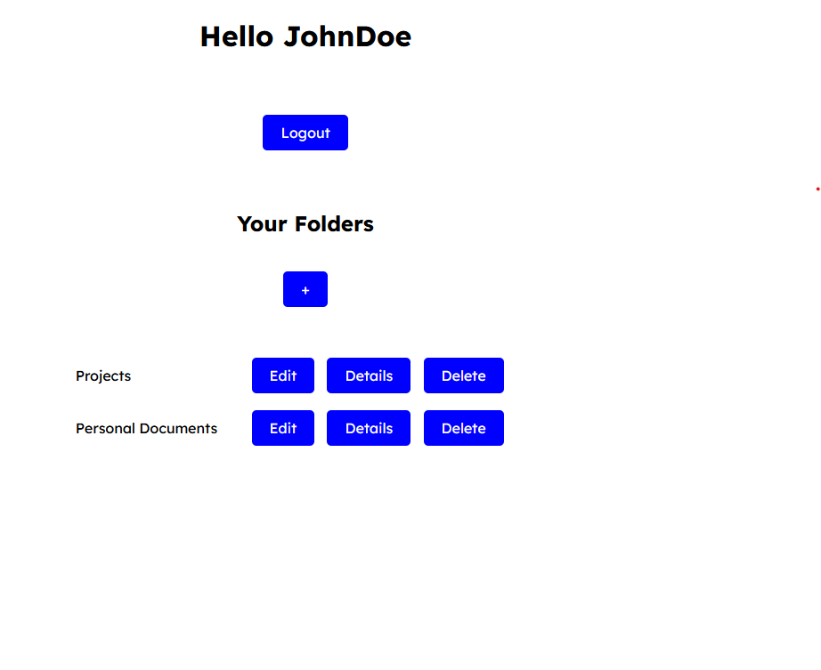
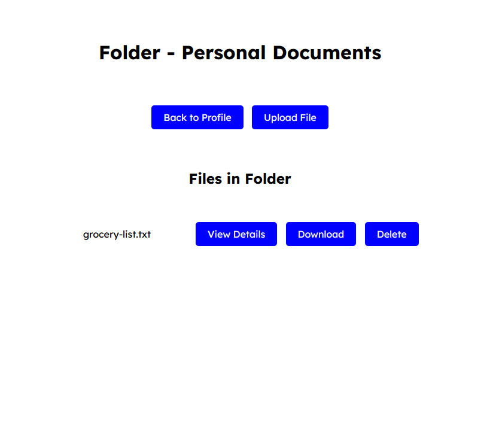

## file-uploader-backend

## Odin Project NodeJS Course Project #5

## Table of Contents
* [Project Overview](#project-overview)
* [Live Demo](#live-demo)
* [Features](#features)
* [Tech Stack](#tech-stack)
* [Setup and Installation](#setup-and-installation)
* [Testing](#testing)
* [What I Learned](#what-i-learned)
* [Future Enhancements](#future-enhancements)
* [License](#license)

## Project Overview
  A multi-page PERN full-stack application built as part of The Odin Project's NodeJS course. It features JWT-based authentication, allows users to perform CRUD operations and utilizes a cloud-based storage solution for all user data.

  ## [Live Demo](https://mizakson-file-uploader.netlify.app/)
  
  
  

## Features
  * __User Authentication__: Secure, JWT-based authentication using Passport.js with a local strategy.

  * __Account Management__: Allows users to create new accounts and log in securely.

  * __Folder Management__: Perform full Create, Read, Update, and Delete operations on folders.

  * __File Operations__: Upload, download, and delete files.

  * __File Details__: View metadata and details for each uploaded file.

  * __Cloud Storage__: Utilizes Supabase for reliable and scaleable file storage.

## Tech Stack

  ### [Backend](https://github.com/Mizakson/file-uploader-backend)
  * __Node.js__: Server-side runtime environment.

  * __Express__: Web application framework for building the API and routing.

  * __Passport.js__: Middleware for handling user authentication.

  * __Prisma ORM__: A modern database toolkit for type-safe database access.

  * __Jest__: A JavaScript testing framework for unit and integration tests.

  * __Supertest__: A library for testing HTTP requests and routes.

  ### Database & Storage
  * __Supabase__: A self-service backend platform used for both PostgreSQL database and cloud file storage.

  * __PostgreSQL__: The relational database used to store user and folder information.

  ### Frontend
  * __React__: A Javascript library for building user interfaces.

  * __React Router__ DOM: For declarative routing within the application.

  * __Vitest__: A unit test framework powered by Vite.

  * __React Testing Library__: For effective testing of React components.

  * __Prop-Types__: For runtime type checking for React props.

  * __CSS__: For styling and layout.


  ## Setup and Installation
  To get a copy of this project up and running on your local machine for development and testing purposes, follow these steps:

  ### Prerequisites
  You will need the following installed:
  
  * [Node.js](https://nodejs.org/en)
  * [npm](https://www.npmjs.com/)

  You will also need an existing [Supabase](https://supabase.com/) project
  
  
  ### Environment Variables
  Create a .env file in the root directory of the project.

  Copy the contents of the .env.example file into your new .env file.
  
  Fill in the values with your credentials from your Supabase project.

  ``` bash
  # Supabase Database URL & Prisma Schema
  DATABASE_URL="postgresql://[USER]:[PASSWORD]@[HOST]:[PORT]/[DATABASE]"

  # Supabase Storage & Service Key
  SUPABASE_URL="https://your-project-id.supabase.co"
  SUPABASE_SERVICE_KEY="your-supabase-service-role-key"
  
  ```
  (Note: None of the environment variables should be shared publicly)

  ### Installation
  1. Clone the backend repository
  ``` bash
  git clone https://github.com/Mizakson/file-uploader-backend.git
  cd file-uploader-backend
  ```

  2. Install backend dependencies
  ``` bash
  npm install
  ```
  
  3. Run Prisma migrations to setup database schema
  ``` bash
  npx prisma migrate dev
  ```

  4. Start the development server
  ``` bash
  npm start
  ```

  The backend will be running at `http://localhost:3000`


  5. Clone the frontend repository. Here is a link to the [frontend repository](https://github.com/Mizakson/file-uploader-frontend)
  ``` bash
    git clone https://github.com/Mizakson/file-uploader-frontend.git
    cd file-uploader-frontend
  ```

  6. Install frontend dependencies
  ``` bash
  npm install
  ```

  7. Run frontend development server
  ``` bash
  npm run dev
  ```

  The frontend will be running at `http://localhost:5173`

  Now you will be able to access and use the application in a development setting after going to the frontend.

  ## Testing
  To run the backend test suite, run the following command(s)
  ``` bash 
  # full backend test suite
  npm test

  # inidivual test file
  jest path/to/individual-testfile.test.js
  ```

  ## What I Learned
  This project was a fantastic opportunity to deepen my understanding of several core concepts in full-stack development, including:
  
  * __Full-Stack Architecture__: Building and connecting a multi-layered application, from the frontend (React) to the backend (Express) and the database (PostgreSQL with Supabase).

  * __JWT Authentication__: Implementing and managing a JWT-based authentication system using Passport.js.

  * __ORM Usage__: Gaining hands-on experience with Prisma

  * __Cloud Services Integration__: Integrating a third-party cloud service (Supabase) for both database management and file storage.

  ## Future Enhancements
  
  * __Drag-and-Drop__: Implement a more user-friendly interface for file uploads using drag-and-drop functionality.

  * __Nested Folders__: Add the ability to create folders within other folders for better organization.
  
 * __UI/UX Improvement__: Enhance the visual design with a modern CSS framework like Tailwind CSS.

  * __Folder Sharing__: Allow users to share a folder using a URL

  ## License
  This project is licensed under the MIT License. See the `LICENSE` file for details.

